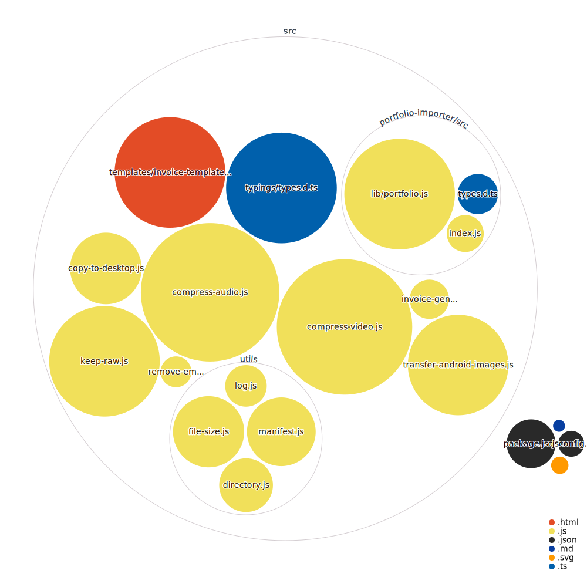

## Setup - Windows Powershell profile

```ps1
function Run-Tool {
    param($toolName)
    Set-Location -Path "O:\node-tools"

    If (!$toolName) {
        Invoke-Expression "pnpm run"
        return
    }

    Invoke-Expression "pnpm run concurrently 'npm:$toolName' -c green"
}
```

Usage:

```ps1
run <toolName>
```
